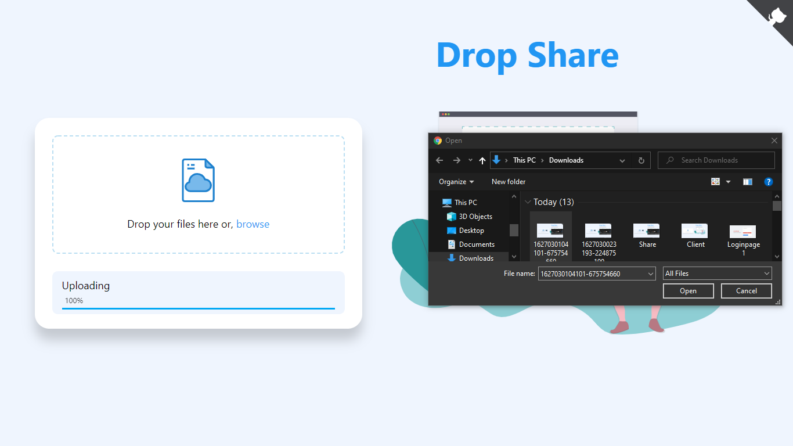

# Drop-share

For accessing the front end code, check file DropShare-FrontEnd

#live link -- https://jayesh37.github.io/DropShare/

## Screenshots

Home Page

Upload

Link

Share

Download

# download, install Dependencies using npm install

# run using npm start backend and frontend using live-server
